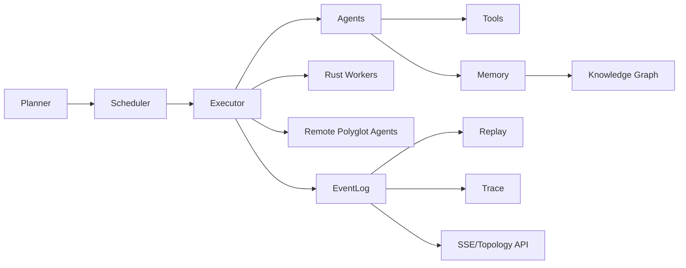

<p align="center">
  
</p>

<h1 align="center">devsper</h1>
<p align="center"><strong>Distributed AI Swarm Runtime</strong></p>

<p align="center">
  <a href="https://pypi.org/project/devsper/"></a>
  <a href="https://www.gnu.org/licenses/gpl-3.0"></a>
  <a href="https://www.python.org/downloads/"></a>
</p>

<p align="center">
  <em>Orchestrate multi-agent systems with a swarm execution model: tasks → DAG → parallel execution.</em>
</p>

> **Install:** PyPI package **`devsper`** · CLI **`devsper`**

---

## Quick start

**1. Install (Python 3.12+):**

```bash
pip install devsper
# or: uv add devsper
```

**2. Set up API keys (pick one):**

Store credentials in your OS keychain so you never re-enter them:

```bash
devsper credentials set openai api_key      # prompts for value
devsper credentials set anthropic api_key
devsper credentials set github token
# or migrate from .env:
devsper credentials migrate
```

Or use environment variables: `OPENAI_API_KEY`, `ANTHROPIC_API_KEY`, `GITHUB_TOKEN`, etc. (see [Credentials](#credentials)).

**3. Create a project and run:**

```bash
devsper init
devsper run "Summarize swarm intelligence in one paragraph."
```

**4. Optional — shell completion:**

```bash
# Bash: add to ~/.bashrc
eval "$(devsper completion bash)"

# Zsh: add to ~/.zshrc
eval "$(devsper completion zsh)"
```

---

## How devsper compares

|  | devsper | swarms | crewai | autogen |
|--|---------|--------|--------|---------|
| Distributed execution | ✅ Python + Rust workers | ❌ Single process | ❌ | ❌ |
| Language-agnostic protocol | ✅ HTTP wire format | ❌ Python only | ❌ | ❌ |
| OpenTelemetry traces | ✅ Native | ❌ | ❌ | ❌ |
| Budget-aware execution | ✅ Per-run limits | ❌ | ❌ | ❌ |
| Persistent agent identities | ✅ Named + memory | ❌ | ⚠️ Partial | ❌ |
| DAG-based task scheduling | ✅ | ❌ Linear/basic | ❌ | ❌ |
| Event replay | ✅ Full run replay | ❌ | ❌ | ❌ |
| Rust worker support | ✅ | ❌ | ❌ | ❌ |
| Deployable agent packages | ✅ .devsper format | ❌ Prompts only | ❌ | ❌ |

## Architecture diagram



## Why devsper

Devsper is distributed-first by design. The execution engine can run locally, across Redis-backed worker pools, or with Rust worker binaries for higher-throughput task execution.

It is observable by default. Runs emit structured events and OpenTelemetry spans for planner, scheduler, executor, agent, and tool boundaries so operators can replay, trace, and debug production runs.

It is polyglot-ready. The HTTP agent protocol allows Python, Rust, Go, and TypeScript services to participate as first-class agents while preserving orchestration controls such as budgeting and DAG scheduling.

## Benchmarks

Performance scripts live in [`benchmarks/`](benchmarks/).

---

## Run from code

**From config file:**

```python
from devsper import Swarm

swarm = Swarm(config="devsper.toml")
results = swarm.run("Analyze diffusion models and write a one-page summary.")
```

**Explicit parameters:**

```python
from devsper import Swarm

swarm = Swarm(worker_count=4, worker_model="gpt-4o-mini", planner_model="gpt-4o-mini", use_tools=True)
results = swarm.run("Your task here.")
```

Credentials are injected from the keyring (or env) when config is resolved—no code changes needed.

---

## Credentials

API keys are **not** stored in config files. Use the **credential store** (OS keychain) or environment variables.

| What you want | Command or method |
|---------------|-------------------|
| Store a key securely | `devsper credentials set <provider> <key>` (prompts; uses keyring) |
| List stored keys (no values) | `devsper credentials list` |
| Import from `.env` / TOML | `devsper credentials migrate` |
| Export for sourcing / `.env` | `devsper credentials export <provider>` → prints `KEY=value` lines |
| Remove a key | `devsper credentials delete <provider> <key>` |

**Providers:** `openai`, `anthropic`, `github`, `gemini`, `azure`, `azure_anthropic` (keys: `api_key`, `token`, `endpoint`, `deployment`, `api_version` as applicable).

**Example — export and source in a script:**

```bash
eval "$(devsper credentials export azure)"
devsper run "Your task"
```

See [Configuration](docs/configuration.md#credentials-api-keys) and [CLI](docs/cli.md#credentials) for details.

---

## CLI

| Command | Description |
|--------|-------------|
| `devsper init` | Set up a new project (`devsper.toml`) |
| `devsper doctor` | Check environment (keys, config, tools) |
| `devsper run "task"` | Run swarm on a task |
| `devsper tui` | Terminal UI (prompt, dashboard, logs) |
| `devsper credentials set/list/migrate/export/delete` | Manage API keys (keyring) |
| `devsper completion bash \| zsh` | Print shell completion script |
| `devsper research [path]` | Literature review on a directory |
| `devsper analyze [path]` | Analyze repository architecture |
| `devsper memory [--limit N]` | List memory entries |
| `devsper query "…"` | Query knowledge graph |
| `devsper workflow <name>` | Run a workflow from `workflow.devsper.toml` |
| `devsper graph [run_id]` | Export task DAG as Mermaid |
| `devsper replay [run_id]` | Replay a run from event log |
| `devsper cache stats \| clear` | Task result cache |
| `devsper analytics` | Tool usage stats |
| `devsper build "app description" [-o dir]` | Autonomous app builder |
| `devsper upgrade [--check \| -y]` | Check for updates / upgrade |

Run `devsper --help` or `devsper <command> --help` for examples and options.

---

## Features

- **Planner → Scheduler → Executor → Agents** — DAG-based execution with configurable parallelism
- **Strategy-based planning** — Auto-selected strategies (research, code, data science, document, experiment) or LLM fallback
- **120+ tools** — Research, coding, data science, documents, experiments, memory; **smart tool selection** (top-k by similarity)
- **TOML config** — `devsper.toml` / `workflow.devsper.toml`; env > project > user > defaults
- **Memory & knowledge graph** — Episodic, semantic, research, artifact memory; summarization, namespaces, entity/relationship search
- **Map-reduce runtime** — `swarm.map_reduce(dataset, map_fn, reduce_fn)` using the worker pool
- **Workflows** — Define steps in `workflow.devsper.toml`; run with `devsper workflow <name>`; **structured output self-correction** (v1.7) retries with a correction prompt when JSON parsing fails
- **Critic & agent messaging (v1.7)** — Optional second-pass critic scores results and requests one retry; per-run message bus lets agents share discoveries via `BROADCAST:`
- **Speculative pre-fetching (v1.7)** — Pre-warm memory and tools for successor tasks while others run; reduces standing-up time
- **Plugin ecosystem** — Discover tools via entry_points (`devsper.plugins`)
- **Provider routing** — OpenAI, Anthropic, Azure, Gemini, **GitHub Models (Copilot)** (`provider:model` or model name); **429 retry with backoff** for GitHub rate limits
- **Automatic model routing** — `planner = "auto"` and `worker = "auto"` for cost/latency/quality-aware selection
- **EventLog, replay, telemetry** — Structured events for debugging and metrics

---

## Architecture

```
    Planner
       ↓
    Scheduler
       ↓
    Executor
       ↓
    Agents  →  Tools  →  Memory  →  Knowledge Graph
```

---

## Configuration

**Priority:** env > project config > user `~/.config/devsper/config.toml` > defaults.

**Locations:** `./devsper.toml`, `./workflow.devsper.toml`, `~/.config/devsper/config.toml`, or legacy `.devsper/config.toml`.

**Keep secrets out of TOML.** Use `devsper credentials` or environment variables for API keys. Non-secret settings (models, workers, paths) go in TOML.

**Example `devsper.toml`:**

```toml
[swarm]
workers = 6
adaptive_planning = true
max_iterations = 10
critic_enabled = true
critic_roles = ["research", "analysis", "code"]
message_bus_enabled = true
prefetch_enabled = true

[models]
planner = "auto"
worker = "auto"

[memory]
enabled = true
store_results = true
top_k = 5

[tools]
enabled = ["research", "coding", "documents"]
top_k = 12

[telemetry]
enabled = true
save_events = true

[providers.azure]
endpoint = ""   # or use credentials store / env
deployment = ""
```

Env overrides: `DEVSPER_WORKER_MODEL`, `DEVSPER_PLANNER_MODEL`, `DEVSPER_EVENTS_DIR`, `DEVSPER_DATA_DIR`, plus provider keys. Full schema: [docs/configuration.md](docs/configuration.md), [docs/providers.md](docs/providers.md).

---

## Distributed mode (v1.10)

Run a **controller** and **workers** across processes or machines. Workers can be Python or **Rust** (`devsper-worker` binary) for higher throughput.

```bash
# Redis + workers + controller (see examples/distributed/README.md)
docker compose up -d
uv run python examples/distributed/run_worker.py   # or Rust: DEVSPER_WORKER_MODEL=github:gpt-4o ./worker/target/release/devsper-worker
uv run python examples/distributed/run_controller.py "Your task" --parallel
```

Rust workers: set `DEVSPER_WORKER_MODEL=github:gpt-4o` (or your model), `DEVSPER_PYTHON_BIN=.venv/bin/python`, `DEVSPER_RPC_PORT=0` for multiple workers on one host. Credentials load from keychain in the subprocess.

---

## Examples

| Workflow | Command |
|----------|---------|
| Distributed (v1.10) | `uv run python examples/distributed/run_controller.py "Task" --parallel` |
| Literature review | `devsper research papers/` or `uv run python examples/research/literature_review.py [dir]` |
| Repository analysis | `devsper analyze .` or `uv run python examples/coding/analyze_repository.py [path]` |
| Dataset analysis | `uv run python examples/data_science/dataset_analysis.py [path-to.csv]` |
| Document intelligence | `uv run python examples/documents/analyze_documents.py [dir]` |
| Parameter sweep | `uv run python examples/experiments/parameter_sweep.py --params '{"lr":[0.01,0.1]}'` |

Outputs under `examples/output/`. Run from project root when using script paths.

---

## Documentation

Full docs (with versioning and dark mode): **[docs.devsper.com](https://docs.devsper.com)**. Source and deploy live in the **docs** repo.

| Doc | Description |
|-----|-------------|
| [Introduction](https://docs.devsper.com/docs/introduction) | What devsper is, problem, core concepts |
| [Architecture](https://docs.devsper.com/docs/architecture) | Planner, Scheduler, Executor, Agents, Tools, Memory, strategies |
| [Configuration](https://docs.devsper.com/docs/configuration) | TOML schema, locations, env, **credentials** |
| [Swarm runtime](https://docs.devsper.com/docs/swarm_runtime) | Task lifecycle, flow, map-reduce |
| [Tools](https://docs.devsper.com/docs/tools) | Registry, runner, smart selection, plugins |
| [Memory](https://docs.devsper.com/docs/memory_system) | Types, store, retrieval, knowledge graph |
| [Providers](https://docs.devsper.com/docs/providers) | Provider routing, Azure, GitHub Models, auto routing |
| [CLI](https://docs.devsper.com/docs/cli) | All commands, **credentials**, completion |
| [TUI](https://docs.devsper.com/docs/tui) | Layout, panels, shortcuts |
| [Examples](https://docs.devsper.com/docs/examples) | Workflows and commands |
| [Development](https://docs.devsper.com/docs/development) | Structure, adding tools/plugins/workflows |
| [Contributing](CONTRIBUTING.md) | Setup, testing, PR guidelines |
| [FAQ](https://docs.devsper.com/docs/faq) | Common questions |

---

## Attribution & Credits
This runtime includes a local “Supermemory-style” subset (`memory.backend="supermemory"`) implemented in Rust (`runtime/supermemory-core`).

What this subset does (local-only; no Supermemory hosted HTTP calls):
- Hybrid ranking: lexical/token overlap + optional embedding cosine similarity
- Relevance filtering: `min_similarity` + top-k truncation
- Deduplication: near-identical memories collapsed deterministically
- Recency tie-breaking: newer memories preferred when scores are close
- MemoryType weighting: research/artifact/semantic/episodic are scored with different multipliers
- Rust-driven `memory_context` formatting: user injections first, then ranked memories

Portions of the approach are inspired by the Supermemory project’s retrieval concepts (semantic recall, metadata/tag filtering, and relevance thresholding), documented in this repo under `supermemory/skills/supermemory/references/`.

## Contributing

Contributions welcome. See [CONTRIBUTING.md](CONTRIBUTING.md).

---

## License

**GPL-3.0-or-later** — see [LICENSE](LICENSE).
