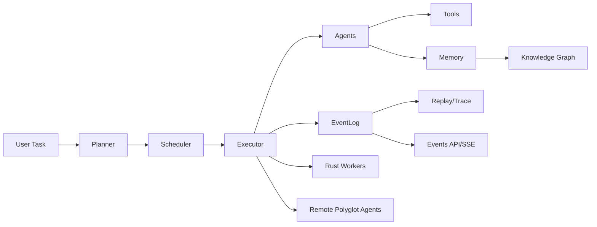

# Architecture

```mermaid
flowchart LR
    User[User Task] --> Planner
    Planner --> Scheduler
    Scheduler --> Executor
    Executor --> Agents
    Agents --> Tools
    Agents --> Memory
    Memory --> KG[Knowledge Graph]
    Executor --> EventLog
    EventLog --> Replay[Replay/Trace]
    EventLog --> API[Events API/SSE]
    Executor --> RustWorkers[Rust Workers]
    Executor --> RemoteAgents[Remote Polyglot Agents]
```
